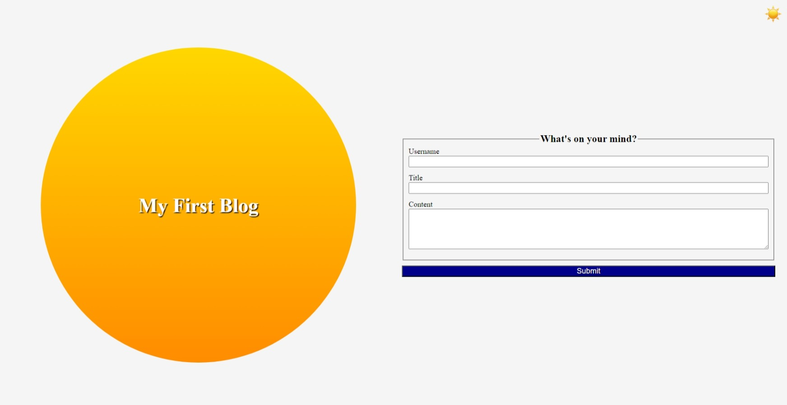

# My Blog

## Description

This webpage was written to be able to keep a blog. It allows the user to enter a username, title and content - all 3 fields are required. You can only add one blog entry 
at a time as the form redirects to the blog page on submit but there is not limit on the number of blog entries you can make. Once a blog entry has been added it will be displayed on the blog page. 
There is also a toggle to go between light and dark mode. Also, the blog page has a back button to make it easier to add more blog entries. I built this project because it gave me valuable experience practicing what
I have learned in Javascript and how to use localStorage. I learned how to get input from users, learned how to crete objects and add them to localStorage. Lastly, I learned how to create light/dark modes using css.

## Usage

To use the webpage, please navigate to https://mattm479.github.io/my-blog. You will need to enter a username, title and content for the bog - all 3 fields are required and then click Submit to add the blog entry. This webpage will look similar to the screenshot below:

## License

License can be found [here](LICENSE).